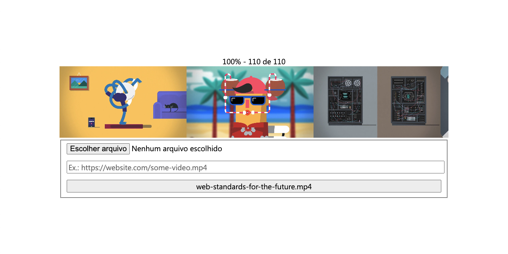

# Video preview thumbnail generator

## Usage

```ts
const size = 320
const ratio = 16 / 9
const url = 'web-standards-for-the-future.mp4'

loadVideo(src, ratio, size)
  .then(drawThumbs)
  .then((canvas) => {
    document.body.append(canvas)
  })
```

## Demo

Access [Demo here](https://guiseek.github.io/video-preview/)


